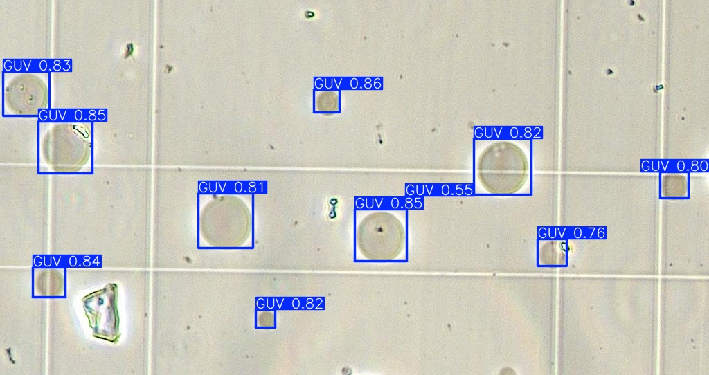
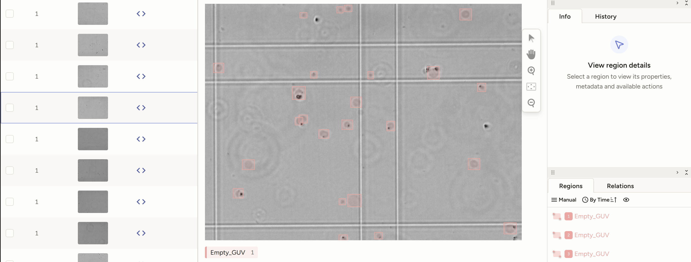
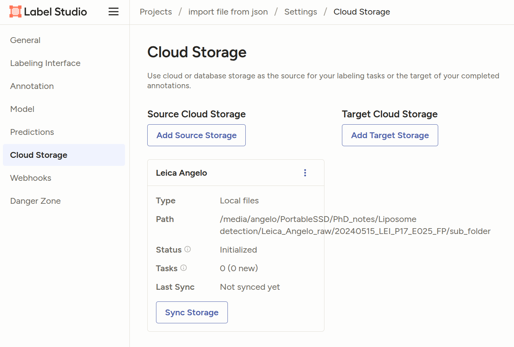
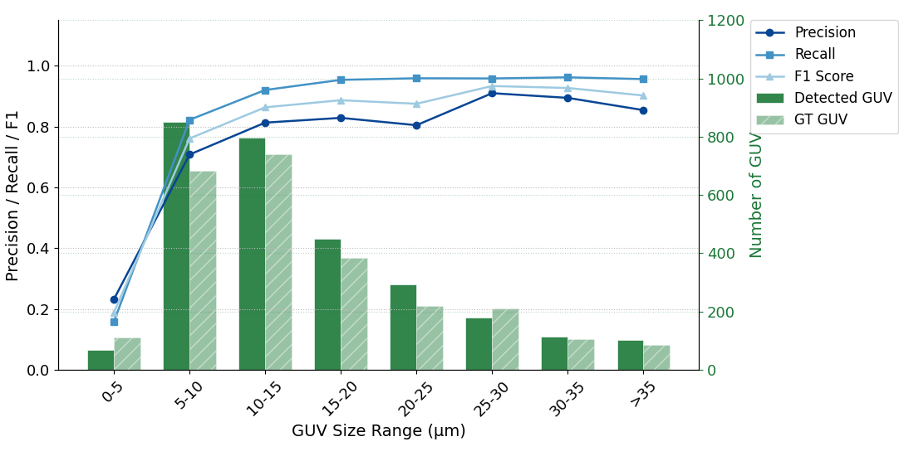
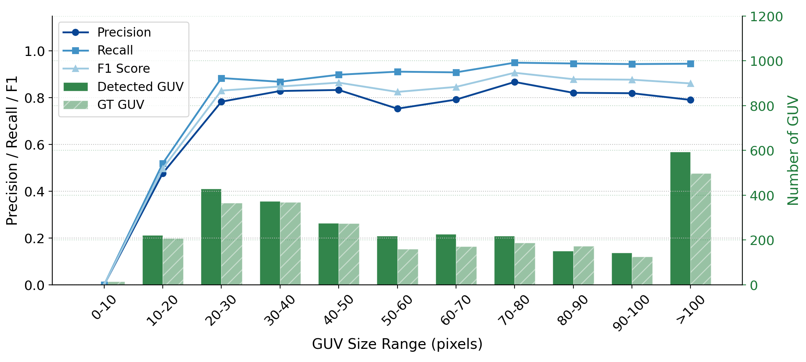
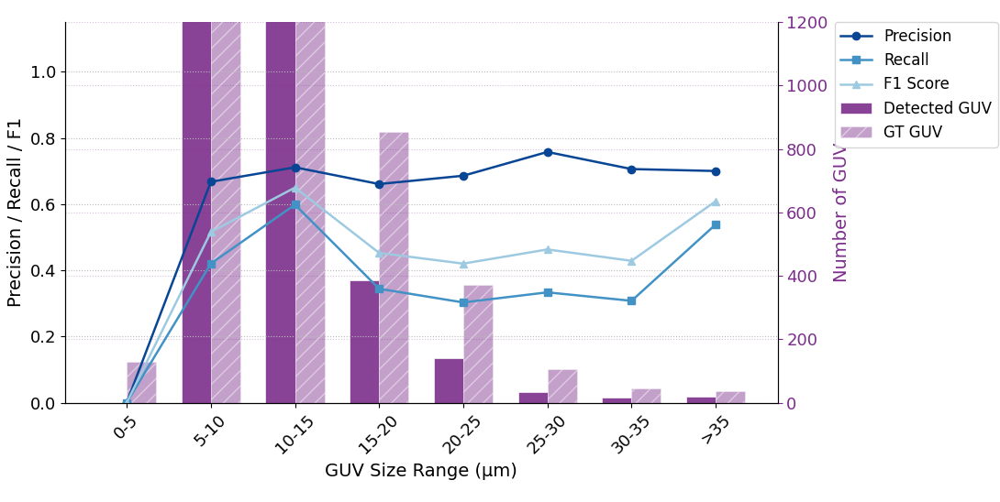
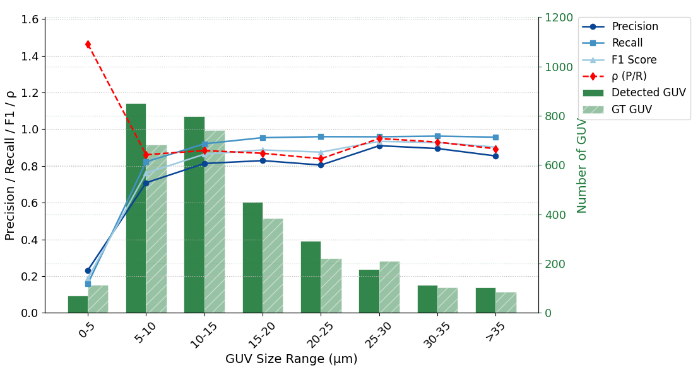
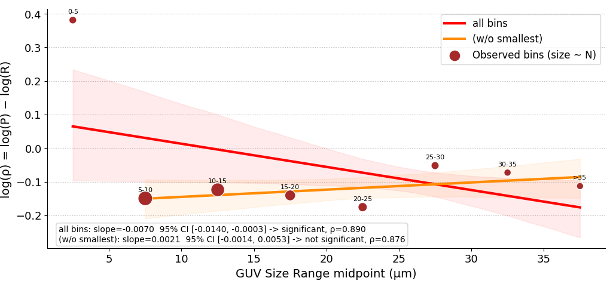
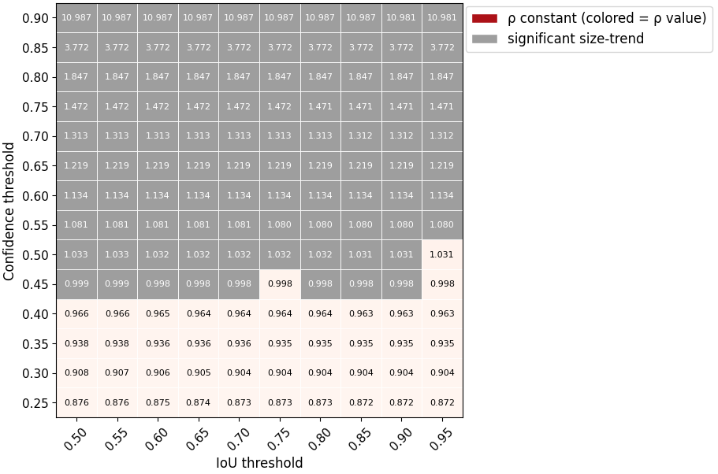

# VesiScope - An automatic tool for GUV Detections
Automatic detection of **Giant Unilamellar Vesicle (GUV)** in miscroscopic images using YOLOv11



This project implements an object detection pipeline using the YOLOv11 algorithm. The system is trained on a custom dataset manually annotated by expert researchers for the localization of GUVs in microscopy images. Although the project is specifically designed for GUV detection, the pipeline is fully generalizable and can be adapted to other types of images.

Check out the [YOLOv11 by Ultralytics](https://docs.ultralytics.com/it/models/yolo11/) for more detailed information about object detection model.

## Install
Installation guideline is based on the Anaconda/Miniconda environment. To install Miniconda, refer to the [official documentation](https://docs.conda.io/projects/miniconda/en/latest/miniconda-install.html).


Create virtual envirornment with python version 3.10:

```bash
conda create --name guv python=3.10
```

Deactivate and activate it with the following comands:

```bash
conda deactivate
conda activate guv
``` 

Clone the repository to your local machine. If git in not installed in new env use `conda install git`.
```bash
git clone git@github.com:AngeloLasala/GUV_detections.git
```

Move to `\guv_detection` directory, activate the virtual environment and install packages with the following comand:
```bash
pip install -e .
```

**!! Note !!**: The Ultralytics package automatically installs the necessary NVIDIA and CUDA dependencies required for GPU usage.

Move to `\guv_detection\app` directory and launch the app with the following comand:
```bash
python app.py
```

## VesiScope – Create the Desktop App

To build your local **VesiScope** app, first make sure the repository is correctly installed (see the Installation section).

After installation, copy your trained model file `best.pth` into the appropriate folder:

- If the model was trained on **grayscale images**, place it in:
  `app/model/grey/`

- If the model was trained on **RGB images**, place it in:
  `app/model/rgb/`

Then, from the root directory of the project, run:

```bash
python build_app.py
```

Once the build process is completed, the executable file **VesiScope.exe** will be created inside the `dist/` folder.
You can copy the .exe file to your desktop (or any preferred location), double-click it, and start using the app.

### Spatial calibration — µm/pixel conversion factors

The app requires a calibration factor to convert pixel measurements to physical units (micrometres). The known values for the microscopes used in this project are:

| Microscope | µm/pixel |
|---|---|
| Leica  | **0.339** |
| Nikon  | **0.1205** |

You can enter the value directly in the app's µm/pixel field, or use the interactive calibration window to derive a custom factor from a known reference distance on your image.

## Label Studio Interface - Create GUV project

Label studio is an open source platform usefull for creating a userfrandly interface to laod an annotate dataset for diverse type of ML project. Here, we provide a simple guideline for creating a project releated to GUV detection

For the sake of simplicity, in this project, we guide the  installation process using [Miniconda](https://docs.conda.io/projects/miniconda/en/latest/miniconda-install.html)

### Create the GUV Detection project
First of all create a virtul env where install the requirement packeges for Label-studio. For Anacondo/Miniconda env:
```bash
conda create --name label-studio python=3.10
conda activate label-studio
conda install psycopg2
pip install label-studio
```

Open the label-studio interface with the following comand lines:
```bash
conda activate label-studio
label-studio
```

Create an object detection progect following the label-studio interface. Select **Object Detection with Bounding Boxes** project. The **code view** for object detection is:
```
<View>
  <Image name="image" value="$image"/>
  <RectangleLabels name="label" toName="image">
    
    
  <Label value="Empty_GUV" background="#FFA39E"/></RectangleLabels>
</View>
```
At this stage, you can load the images and start the manual annotations.

**NOTE!!**: the Label studio interface runs on a localholst 8080 that must be activate during the usage. The suggestion is to open an *Anaconda prompt (Miniconda)* and lanch the above code without closing the windows.

Here an example of label studio project for GUV manual annotation


Once the annotations are done, go to **Export** -> **YOLO with Images** to get images and label ready to be use for training and/or testing Yolov11 model!!

### Import Images and Pre-annotation with JSON file

This guide explains how to import images and pre-annotated data into a Label Studio project using a JSON file. This approach allows you to create tasks efficiently and optionally include pre-annotations.
For details about the JSON format and the preannotation see [Basic Label studio JSON format](https://labelstud.io/guide/tasks#Basic-Label-Studio-JSON-format) and [Import pre-annotated data into Label Studio](https://labelstud.io/guide/predictions)

Before open the label-studio project, you have to lunch wiht the permission to access a local path. Organize your files in a structured directory:

```
| document_root
|   |-- folder_path
|   |   |-- image_1.jpg
|   |   |-- image_2.jpg
|   |   |-- image_n.jpg
```

To allow Label Studio to access local files, set the following environment variables:

```bash
export LABEL_STUDIO_LOCAL_FILES_SERVING_ENABLED=true
export LABEL_STUDIO_LOCAL_FILES_DOCUMENT_ROOT="document_root"
```
For **Windows users**, use the command  `set` in **Command Prompt** terminal instead of `export` for setting the above variables.

Then, start label-studio:

```bash
label-studio
```

Open the project, and follow this guideline for setting the local file envirormnet for [Setuping connection in Label Studio UI](https://labelstud.io/guide/storage#Set-up-connection-in-the-Label-Studio-UI-4)

- Open **Setting > Cloud Storage**
- Click **Add Source Storage**
- Select **Local Files** as the storage type
- Insert a name for your storage title: example Leica Angelo
- Specify an **Absolute local path** to the directory with your files. For the tree configuration above insert  `document_root/folder_path`. Then **Text Connection** and click **Next**
- *(Optional)* In the File Filter Regex field, specify a regular expression to filter bucket objects. Use .* to collect all objects.
- *(Optional)* In the Import method dropdown, choose how to import your data:
    - Files - Automatically creates a task for each storage object (e.g. JPG, MP3, TXT). Use this if you want to create Label Studio tasks from media files automatically. Use this option for labeling configurations with one source tag.
    - Tasks - Treat each JSON, JSONL, or Parquet as a task definition (one or more tasks per file). Use this if you want to import tasks in Label Studio JSON format directly from your storage. Use this option for complex labeling configurations with HyperText or multiple source tags.
- Click **Next**
- Finally click **Save**. **DO NOT** save and sync

Example of storage setup in Label Studio:

Again, **DO NOT click** on **Sync Storage** in this phase. For **Windows users**, use the correct symbol (`\`) for concatenating paths

- Go to the **Project > Import**
- Import a file  `import.json`
  
Then, the user can use Label Studio interface to edit the annotations: manually adding/deleting bounding boxes of GUVs and exporting the updated JSON file at the end of re-annotation process.
After this step, run the code [analysis.py](https://github.com/AngeloLasala/GUV_detections/tree/main/guv_detection/pre_annotation) to obtain a more precise size distribution analysis. 

### How to create `import.json` file - Pre-annotation

For obtaing pre-annotations, use a trained model that returns the bounding box of GUVs. For details about the training see [this section](#Training). Run the following code:

```bash
python inference.py --model "path:to_model_weight.pth" --folder "document_root/folder_path"
```

It creates `predict\labels` with file `image_1.txt` that cointains predicted bounding boxes. The, you can generate `import.json` with the following command

```bash
python create_json.py --document_root document_root --folder_path folder_path
```
For **VesiScope** users, the `import.json` file is automatically created during inference phase.

## Usage for custom training

### Dataset
The dataset used to train and validate the GUV Detector consists of microscopy images of GUVs, annotated by expert researchers in the field. The data is organized as follows:

```
| DATA
|   |-- train
|   |   |-- images
|   |   |   |-- image_1.jpg
|   |   |   |-- image_2.jpg
|   |   |   |-- ...
|   |   |-- labels
|   |   |   |-- image_1.txt
|   |   |   |-- image_2.txt
|   |   |   |-- ...
|   |-- val
|   |   |-- images
|   |   |-- labels
|   |-- test
|   |   |-- images
|   |   |-- labels
```

The current version of the project supports both .png and .jpg image formats.
Each corresponding label.txt file must follow the Ultralytics YOLO annotation format. Please refer to the official Ultralytics documentation for detailed [annotation guidelines](https://docs.ultralytics.com/it/datasets/detect/#supported-dataset-formats) .

To ensure compatibility and prevent errors, use the **Label Studio Interface – Create GUV Project** guide above to take full advantage of Label Studio for annotation!

### Training

Once the dataset is prepared, you can train your custom model using the `train.py` script.

```bash
python train.py --model --epoch --folder --modality
```

The dataset folder used for training must be organized as follows:
```
| folder
|   |-- modality_1
|   |   |-- DATA
|   |-- modality_2
|   |   |-- DATA
```
Each modality (e.g., `rgb`, `grey`) should contain its own DATA directory with the standard `train`, `val`, and `test` subfolders.

### Training on Google Colab

For GPU-accelerated training without a local GPU, two ready-to-use Colab notebooks are provided in `guv_detection/tools/`:

| Notebook | Modality | Google Drive path |
|---|---|---|
| [`train_grey.ipynb`](guv_detection/tools/train_grey.ipynb) | Greyscale | `DATA_training_grey_txt/` |
| [`train_rgb.ipynb`](guv_detection/tools/train_rgb.ipynb) | RGB | `DATA_training_rgb_txt/` |

Both notebooks follow the same pipeline:
1. Mount Google Drive and navigate to the dataset directory.
2. Install Ultralytics (`pip install ultralytics`).
3. Build YOLOv11-nano from YAML, load pretrained ImageNet weights, and fine-tune for 100 epochs at 640 × 640 px (`model.train(data="data.yaml", epochs=100, imgsz=640)`).
4. Run inference on the test split and save labelled results to `runs/detect/predict*/`.

Before opening a notebook, upload the `train/`, `val/`, and `test/` folders together with `data.yaml` to the corresponding Google Drive directory, then run all cells in order. Trained weights are saved under `runs/detect/trainX/weights/best.pt`.

## Evaluation

Model performance is evaluated bin-wise by GUV size, using IoU-based matching (IoU ≥ 0.5) between predicted and ground-truth bounding boxes. For each size bin, Precision, Recall, and F1-score are computed alongside the raw detection counts.

GUV size is expressed in physical units (µm) using the dataset formula:

$$\text{size} = \frac{\sqrt{d_{\max}^2 + d_{\min}^2}}{\sqrt{2}} \times \mu\text{m/pixel}$$

where $d_{\max}$ and $d_{\min}$ are the longer and shorter sides of the bounding box in pixels.

The figure below shows the evaluation of the **YOLOv11-nano** model trained on **greyscale** images (Nikon, 0.1205 µm/pixel). The model achieves consistently high Recall (> 0.85) across all size ranges, with Precision slightly lower for very small GUVs (< 2 µm), where detections are sparse.



The same evaluation expressed in **raw pixel units** is shown below. The model population is concentrated in the 20–50 px range; performance drops only for the smallest bin (0–10 px), where GUVs occupy fewer than ~10 pixels on a side and are inherently ambiguous. From 10 px upward, both Precision and Recall exceed 0.8 and remain stable across all size bins, confirming that the performance pattern is consistent regardless of the calibration factor applied.



### Out-of-distribution generalisation — Leica

To assess cross-domain generalisation, the same model (no retraining) was evaluated on Leica acquisitions, which differ from the training distribution in microscope optics, pixel size (0.45 µm/pixel), and image contrast. The figure below uses the same bin-wise protocol as above but with Leica calibration applied.



<!-- To run the evaluation on your test set:

```bash
python guv_detection/evaluation/advanced_evaluation.py \
  --model_size n \
  --modality grey \
  --folder <path_to_data_root>
```

The script expects a `predict_{model_size}/` folder inside the test split (generated by `test.py`) and produces two figures: one with bbox sizes in pixels and one in µm. -->

## Robust Estimation

Bounding-box detections are not a perfect count of real GUVs: the model misses some real vesicles (imperfect recall) and occasionally reports false ones (imperfect precision). The *detected* size distribution is therefore a biased sample of the *real* one. Before using detection counts for any downstream size-distribution analysis, we need a principled way to correct for that bias.

### Defining ρ

For a set of detections, let $P = TP/(TP+FP)$ and $R = TP/(TP+FN)$. Since $TP = P \cdot N_{\text{pred}} = R \cdot N_{\text{real}}$ (where $N_{\text{pred}} = TP+FP$ is the detected count and $N_{\text{real}} = TP+FN$ is the true count), it follows that:

$$N_{\text{real}} = \frac{P}{R} \cdot N_{\text{pred}} = \rho \cdot N_{\text{pred}}$$
$$\rho = \frac{P}{R}$$

$\rho$ is the correction factor that turns an observed (predicted) GUV count into an estimate of the real one.
It is useful as a *single* correction factor if it does not itself depend on GUV diameter. If $\rho$ varied systematically with size, applying one global value to the whole predicted size distribution would not remove the detection bias. Checking that $\rho$ is statistically constant across size bins is therefore a prerequisite for trusting it as a correction factor at all.

### Bin-wise evaluation at the reference operating point



Evaluation at the reference operating point used throughout this project: **confidence threshold = 0.25**, **IoU threshold = 0.5**. The **IoU threshold** here is the *matching* threshold: for each surviving prediction, the best-overlapping unclaimed ground-truth box is found, and the pair counts as a true positive only if `IoU ≥ 0.5` (Intersection-over-Union: overlap area divided by union area); otherwise it's a false positive, and any ground-truth box left unclaimed becomes a false negative. The bin-wise P/R/F1 shown here is a snapshot of a single confidence operating point (0.25) at IoU=0.5.

The `0-5 µm` bin stands out: very few detections relative to its ground-truth count. From `5-10 µm` upward, Precision, Recall and F1 all settle in the 0.7–0.96 range and ρ stays close to 1.

### ρ is constant for GUVs larger than 5 µm



Fitting the trend of $\log(\rho) = \log(P) - \log(R)$ against bin diameter (cluster-by-image bootstrap, 95% CI) confirms the `0-5 µm` bin could be consider an outliner: including it, the slope is **significantly negative** (95% CI excludes 0), which would suggest ρ is *not* constant. Excluding only that one bin, the slope drops to essentially zero (95% CI includes 0, *not significant*), with a pooled ρ = 0.876. **For GUVs larger than 5 µm, ρ is statistically constant**. A single global correction factor can be applied across that whole size range without introducing a new size-dependent bias, i.e. it preserves the shape of the corrected distribution.

The 95% CI comes from a cluster-by-image bootstrap: images are resampled with replacement (2000 iterations), the trend is re-fit on each resample, and the CI is the 2.5th/97.5th percentile of the resulting 2000 slopes, resampling whole images, not individual boxes, preserves the correlation between GUVs detected in the same image.

### Robustness across confidence and IoU thresholds



The same "excl. 0-5µm" trend fit was repeated across a grid of confidence and IoU thresholds (bootstrap per cell). Gray cells mean the size-trend is significant at that operating point (ρ not trustworthy as a single number there); colored cells mean ρ is constant. **For confidence ≤ 0.40, cells are colored across the entire IoU range (0.50–0.95) with barely any variation in the printed ρ value along each row**. At conf=0.25, ρ goes from 0.876 down to 0.872 as IoU sweeps from 0.50 to 0.95. In that confidence regime, the correction factor may be consider **independent of which IoU matching threshold is chosen**. At higher confidence thresholds, cells turn gray, the constant-ρ assumption stops holding once the confidence threshold is pushed high enough to discard too many of the harder, smaller detections.

For this in-distribution dataset, `ρ = P/R` can be consider a is a robust orrection factor, single-number correction factor for GUVs **larger than 5 µm**, stable across the whole IoU-matching range as long as the confidence threshold stays **≤ 0.40**. Outside that regime, ρ can no longer be treated as size- and threshold-independent, and any correction there needs to be handled per-bin/per-operating-point rather than with one global factor.

## Dataset

The annotated dataset used to train and evaluate VesiScope will be available at the following repository:

[GUV Dataset Repository](https://github.com/AngeloLasala/GUV_dataset)
